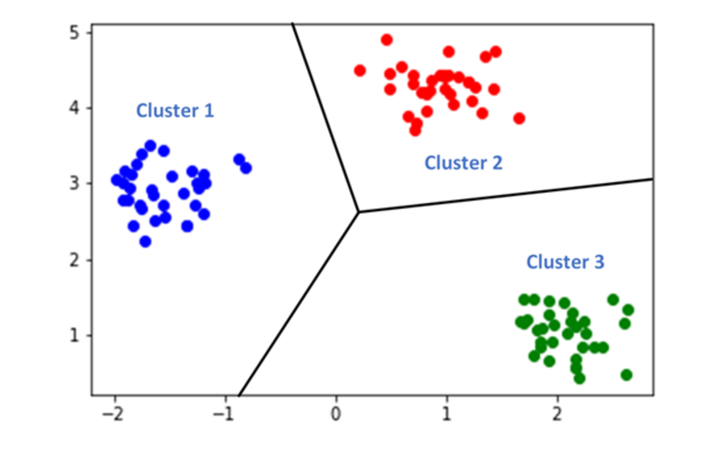

# BASIC ML

<h2 align="center">
  
</h2>

<br/><br/>

-------

## Content

- [`About the project`](#about-the-project)
- [`Project structure`](#project-structure)
- [`Functionalities that are implemented`](#functionalities-that-are-implemented)
- [`Usage`](#usage)
- [`What's next`](#what's-next)
- [`Supporting developers`](#supporting-developers)

<br/><br/>

-------

## About the project

Repository holds a library of most common algorithms used manually without using the help of <a href="https://scikit-learn.org/stable/" target="_blank">`sklearn`</a> or other Machine Learning libraries.
Only used libraries are:
- built-in libraries that belong to Python
- <a href="https://numpy.org/" target="_blank">`numpy`</a>
- <a href="https://docs.scipy.org/doc/scipy/reference/index.html" target="_blank">`scipy`</a> - only used for <a href="https://docs.scipy.org/doc/scipy/reference/generated/scipy.cluster.hierarchy.dendrogram.html" target="_blank">`dendrogram`</a> function in `scipy.cluster.hierarchy`
- <a href="https://plotly.com/" target="_blank">`plotly`</a>
- <a href="https://github.com/tqdm/tqdm" target="_blank">`tqdm`</a> - for showing progress of training
- <a href="https://github.com/HIPS/autograd" target="_blank">`autograd`</a> - for derivation of functions
- <a href="https://jupyterlab.readthedocs.io/en/stable/" target="_blank">`jupyterlab`</a> (as development environment and to call all other scripts)

Those can be installed via:
```cmd
pip install numpy scipy plotly tqdm autograd jupyterlab
```

<br/><br/>

-------

## Project structure

The project is structured as follows:

- <a href="assets/" target="_blank">`assets/`</a> - containing all graphics that are shown here
- <a href="library/" target="_blank">`library/`</a> - containing the respective scripts for all subtasks:
    - <a href="library/classic_learning/" target="_blank">`classic_learning/`</a> - contains all `classic` Machine Learning algorithms
    - <a href="library/deep_learning/" target="_blank">`deep_learning/`</a> - contains Deep Learning using Neural Networks
    - <a href="library/reinforcement_learning/" target="_blank">`reinforcement_learning/`</a> - contains Reinforcement Learning algorithms
    - <a href="library/utils/" target="_blank">`utils/`</a> - contains different kind of `helper` functions and classes
- <a href="Test.ipynb" target="_blank">`Test.ipynb`</a> - a `Jupyter Notebook` containing a test implementation of all provided functionality

<br/><br/>

-------

## Functionalities that are implemented

<br/><br/>

- <a href="library/classic_learning/" target="_blank">`classic_learning`</a>
  - Linear Regression (with single- and multi-dimensional data support) <a href="https://scikit-learn.org/stable/modules/generated/sklearn.linear_model.LinearRegression.html" target="_blank">`Linear Regression by sklearn`</a>
  <h2 align="center">
    
  </h2>

  - Clustering <a href="https://scikit-learn.org/stable/modules/clustering.html" target="_blank">`Clustering by sklearn`</a>
  <h2 align="center">
    
  </h2>

  - Dimension Reduction Algorithms (LDA, PCA and ICA) <a href="https://scikit-learn.org/stable/modules/unsupervised_reduction.html" target="_blank">`Dimension Reduction by sklearn`</a>
  <h2 align="center">
    
  </h2>

  - Gaussian Mixture Models with Expectation Maximization Algorithm <a href="https://scikit-learn.org/stable/modules/generated/sklearn.mixture.GaussianMixture.html" target="_blank">`GMM with EM by sklearn`</a>
  <h2 align="center">
    
  </h2>

  - Gaussian Processes Regression <a href="https://scikit-learn.org/stable/modules/generated/sklearn.gaussian_process.GaussianProcessRegressor.html" target="_blank">`GP by sklearn`</a>
  <h2 align="center">
    
  </h2>

<br/><br/>

- <a href="library/reinforcement_learning/" target="_blank">`reinforcement_learning`</a> - see in general: <a href="https://pythonprogramming.net/q-learning-reinforcement-learning-python-tutorial/" target="_blank">`Reinforcement Learning Tutorial by PythonProgramming`</a>
  - Action Value Iteration for Reinforcement Learning - <a href="https://github.com/dennybritz/reinforcement-learning/tree/master/DP" target="_blank">`Action Value Iteration by Denny Britz & Co`</a>
  - Q-Learning for Reinforcement Learning - <a href="https://github.com/dennybritz/reinforcement-learning/tree/master/DQN" target="_blank">`Q-Learning by Denny Britz & Co`</a>
  <h2 align="center">
    
  </h2>

  - Hidden Markov Models <a href="http://scikit-learn.sourceforge.net/stable/modules/hmm.html" target="_blank">`HMM by sklearn`</a>
  <h2 align="center">
    
  </h2>

  - Genetic Algorithm for DataSet manipulation <a href=https://pypi.org/project/sklearn-genetic/ target="_blank">`Genetic algorithm by sklearn`</a>
  <h2 align="center">
    
  </h2>

<br/><br/>

- <a href="library/deep_learning/" target="_blank">`deep_learning`</a>
  - Deep Learning using Neural Networks [containing Convolution-, Pooling-, Dense-, Flatten-, Dropout- and ReLU-Layer] <a href="https://www.tensorflow.org/tutorials/keras/classification" target="_blank">`Deep Learning by Tensorflow`</a>
  <h2 align="center">
    
  </h2>

<br/><br/>

- <a href="library/utils/" target="_blank">`utils`</a>
  - Data Preprocessing for DataSet manipulation (containing a MinMaxScaler and a train_test_split()-function) <a href=https://scikit-learn.org/stable/modules/preprocessing.html target="_blank">`Preprocessing by sklearn`</a>
  <h2 align="center">
    
  </h2>


<br/><br/>

-------

## Usage

In general all classes and functions can be used exactly as those which are implemented in <a href="https://scikit-learn.org/stable/" target="_blank">`sklearn`</a> with a `training()`, a `predict()` and a `score()` - if possible - function.

Algorithms that work exactly as describe above, respectively in their sklearn documentation:
- Linear Regression -> Regressor
- Clustering -> Classifier
- Dimension Reduction - `train()`, `predict()` and `score()` function are `fit()`, `fit_transform()` and `transform()` respectively
- Gaussian Mixture Models with Expectation Maximization Algorithm -> Classifier
- Gaussian Processes -> Regressor
- Deep Learning using Neural Networks - has its one `score()` function as being the `loss()` function in training. Workwise/Usage in the same way as <a href=https://www.tensorflow.org/ target="_blank">`Tensorflow Implementation`</a> 

Algorithms with different work-wise:
- Reinforcement Learning --> since there is no prediction in the workwise of RL, there is no such function implemented. Furthermore there is no (or not yet) `train()` function implemented, since the user is obliged to self-decide whether or not to use <a href="https://en.wikipedia.org/wiki/Q-learning" target="_blank">`Q-Learning`</a> or <a href="https://towardsdatascience.com/the-value-iteration-algorithm-4714f113f7c5" target="_blank">`Action-Value-Iteration`</a>.
- Hidden Markov Models --> as they need a sequence to be trained and initial states and observations, the class is used slightly different to `sklearn`-typical work wise. You have to provide a sequence to all of the implemented algorithms, further instructions can be found on top of the class description in the <a href="library/reinforcement_learning/hmm.py" target="_blank">`hmm.py`</a> script.
- Genetic Algorithm for DataSet manipulation --> since there is no prediction in the workwise of GA, there is no such function implemented. The `train()` function gives back the best 'subdataset' that exists (in the original dataset or mutated from that)

<br/><br/>

-------

## What's next

- working on the Deep Learning module
- go through all the algorithms and add further variety

<br/><br/>

-------

## Supporting developers

- <a href="https://github.com/papstchaka" target="_blank">`Alexander Christoph`</a>