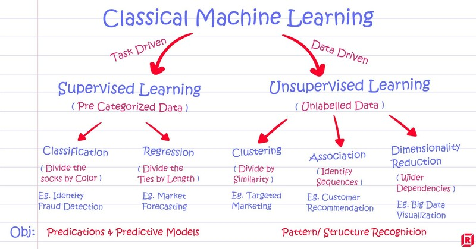
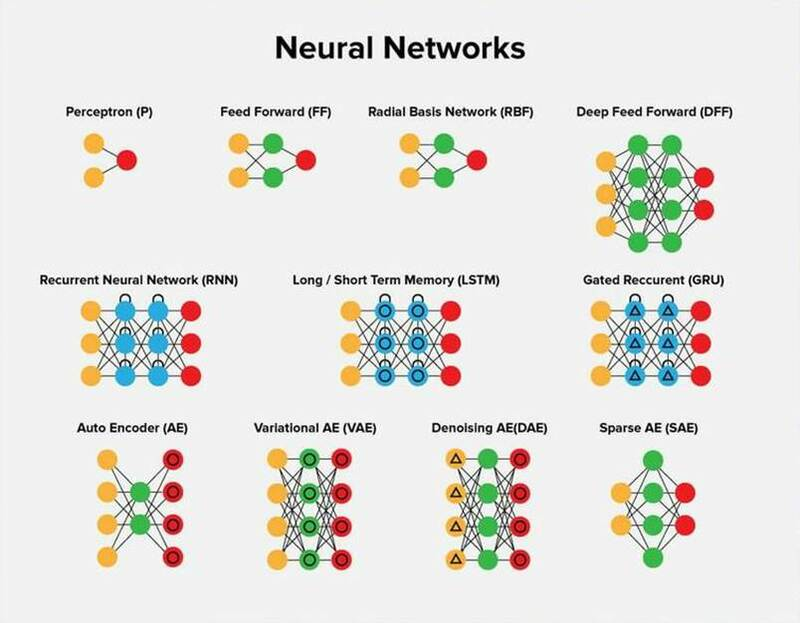
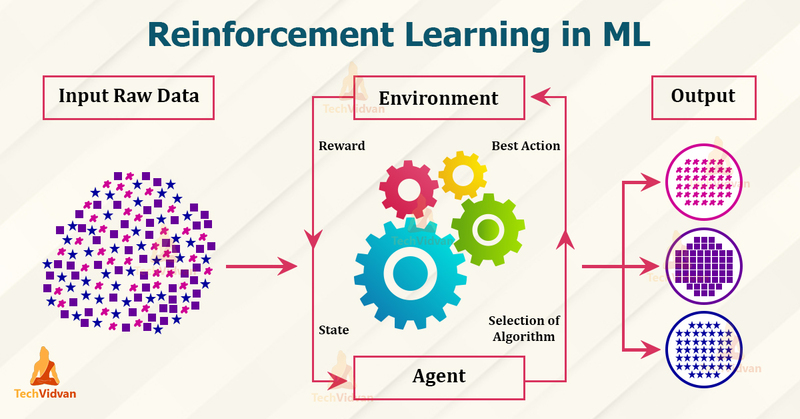

## `library`

contains the respective scripts for all subtasks

  

-------

## <a href="classic_learning/" target="_blank">`classic_learning/`</a>

contains all `classic` Machine Learning algorithms

<h2 align="center">
    
</h2> 

  

-------

## <a href="deep_learning/" target="_blank">`deep_learning/`</a>

contains Deep Learning using Neural Networks

<h2 align="center">
    
</h2> 

  

-------

## <a href="reinforcement_learning/" target="_blank">`reinforcement_learning/`</a>

contains Reinforcement Learning algorithms

<h2 align="center">
    
</h2> 

  

-------

## <a href="utils/" target="_blank">`utils/`</a>

contains different kind of `helper` functions and classes