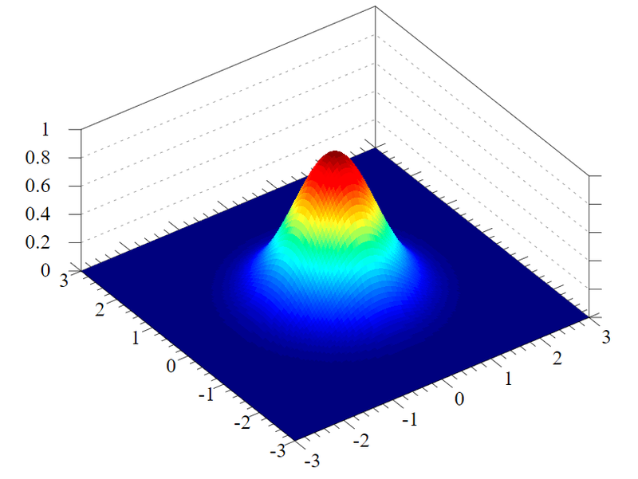

# `classic_learning`

contains all `classic` Machine Learning algorithms

  

-------

## <a href="clustering.py" target="_blank">`clustering.py`</a>

implements Clustering algorithms, similar to <a href="https://scikit-learn.org/stable/modules/clustering.html" target="_blank">`Clustering by sklearn`</a>.

Clustering is a big part of <a href="https://towardsdatascience.com/unsupervised-learning-and-data-clustering-eeecb78b422a" target="_blank">`Unsupervised Learning`</a> when no label is given to any samples of data. `Cluster algorithms` are looking for similarities in between different samples and unite those samples into respective clusters. With that, coherences can be found in massive amounts of data, helping to preprocess `Big Data`.

A very good overview about the importance and functionality of the most common cluster algorithms can be found <a href="https://towardsdatascience.com/the-5-clustering-algorithms-data-scientists-need-to-know-a36d136ef68" target="_blank">`here`</a>. Mulitple of the presented algorithms are implemented in this project:

- `K-Means` Clustering similar to <a href="https://www.analyticsvidhya.com/blog/2018/03/introduction-k-neighbours-algorithm-clustering/" target="_blank">`K-Nearest-Neighbors`</a>
- `Expectation-Maximization (EM)` Clustering using Gaussian Mixture Models (GMM) 

    &rightarrow; implemented in [`gmm.py`](#<a-href="gmm.py"-target="_blank">`gmm.py`</a>)
- `Agglomerative Clustering`, providing a respective dendrogram as output

Furthermore <a href="https://www.geeksforgeeks.org/ml-hierarchical-clustering-agglomerative-and-divisive-clustering/" target="_blank">`Divisive Clustering`</a> in form of `Non-Uniform-Binary-Split` is implemented.

  

-------

## <a href="dimension_reduction.py" target="_blank">`dimension_reduction.py`</a>

implements Dimension Reduction Algorithms (LDA, PCA and ICA), similar to  <a href="https://scikit-learn.org/stable/modules/unsupervised_reduction.html" target="_blank">`Dimension Reduction by sklearn`</a>.

To handle massive amounts of data, it can be helpful to reduce the dimensionality of the given dataset. Concrete, this means to drop some features if they do not contain helpful information or to merge different kinds of features.

Three of the most common algorithms to reduce the amount of data - and thereafter speedup calculations and save storage - are `Principal Component Analysis (PCA)`, `Independent Component Analysis (ICA)` and `Linear Discriminant Analysis (LDA)`. All of them are implemented here:

- <a href="https://medium.com/apprentice-journal/pca-application-in-machine-learning-4827c07a61db" target="_blank">`PCA`</a> merges different features into new ones that help to increase the covariance in-between the new features. This leads to a reduced number of features being uncorrelated to each other
- <a href="https://danieltakeshi.github.io/2015/01/03/independent-component-analysis-a-gentle-introduction/" target="_blank">`ICA`</a> is used to seperate multiple overlapping signals into their original signals. A common problem where `ICA` is used is the <a href="https://en.wikipedia.org/wiki/Cocktail_party_effect" target="_blank">`Cocktail Party Problem`</a> when you try to seperate all the individual conversations from eachother or the music.
- <a href="https://www.knowledgehut.com/blog/data-science/linear-discriminant-analysis-for-machine-learning" target="_blank">`LDA`</a> tries to maximize the class distance of two variables. If you have two features than you can use `LDA` to transform the data in a way that it is much easier to determine a fixed barrier to seperate two classes from eachother.

A brief comparison about similarities and differences of `PCA` and `LDA` can be found <a href="https://github.com/snayan06/Dimensionality-Reduction-Technique-PCA-LDA-ICA-SVD" target="_blank">`here`</a>.

  

-------

## <a href="gmm.py" target="_blank">`gmm.py`</a>

implements Gaussian Mixture Models with Expectation Maximization Algorithm, similar to <a href="https://scikit-learn.org/stable/modules/generated/sklearn.mixture.GaussianMixture.html" target="_blank">`GMM with EM by sklearn`</a>.

As mentioned [`above`](#<a-href="clustering.py"-target="_blank">`clustering.py`</a>), <a href="https://brilliant.org/wiki/gaussian-mixture-model/" target="_blank">`Gaussian Mixture Models`</a> can be used for `Clustering` purposes. `Gaussian Mixture Models` in general assume the data to be in `gaussian` shape.

<h2 align="center">
    
</h2> 

Above picture shows graphically how such a distribution can be assumed in `3D`. For `2D` you can just imagine to take a look from above onto the graphic, resulting in an elliptic form for the distribution. Assuming `1D` respectively is the same as taking a look only from one side - `x-Axis` or `y-Axis` - onto the graphic, resulting in a curve that seems similar to a downward opened parabola.

The <a href="https://bjlkeng.github.io/posts/the-expectation-maximization-algorithm/" target="_blank">`Expectation-Maximization (EM) Algorithm`</a> (also see <a href="https://en.wikipedia.org/wiki/Expectation%E2%80%93maximization_algorithm" target="_blank">`here`</a>) now tries to fit the data into (multiple) of such distribution. The algorithm thereafter can also be used for <a href="https://machinelearningmastery.com/types-of-classification-in-machine-learning/" target="_blank">`Classification`</a> in the field of <a href="https://www.geeksforgeeks.org/supervised-unsupervised-learning/" target="_blank">`Supervised Learning`</a>.

  

-------

## <a href="gp.py" target="_blank">`gp.py`</a>

implements Gaussian Processes Regression Algorithm, similar to <a href="https://scikit-learn.org/stable/modules/generated/sklearn.gaussian_process.GaussianProcessRegressor.html" target="_blank">`GP by sklearn`</a>

Similar to [`below`](#<a-href="linear_regression.py"-target="_blank">`linear_regression.py`</a>), <a href="https://distill.pub/2019/visual-exploration-gaussian-processes/" target="_blank">`Gaussian Processes (GP)`</a> can be used for <a href="https://en.wikipedia.org/wiki/Regression_analysis" target="_blank">`Regression`</a> purposes. `GP's` also assume the data to be gaussian distributed.

  

-------

## <a href="linear_regression.py" target="_blank">`linear_regression.py`</a>

implements Linear Regression Algorithm (with single- and multi-dimensional data support), similar to <a href="https://scikit-learn.org/stable/modules/generated/sklearn.linear_model.LinearRegression.html" target="_blank">`Linear Regression by sklearn`</a>.

Some possible algorithms to implement a `Regression` can be found <a href="https://www.javatpoint.com/regression-analysis-in-machine-learning" target="_blank">`here`</a>. The following are implemented here:

- `Linear Regression` that assumes the data being able to be explained by a linear curve